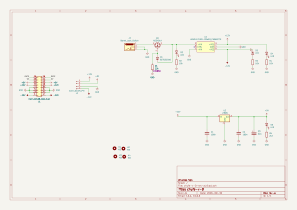
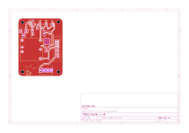

# chufe

Fuente de alimentación eurorack: recibe 12 V DC por un jack y entrega ±12V y +5V en un header de 16 pines (2x08) y en un conector Molex KK-396 de 4 pines.

## Revisiones

- `v0.1 rev-a`: octubre 2026, todavía sin probar.

## Cómo funciona

1. La entrada llega por el jack DC (J3) y pasa por un MOSFET canal P (Q1) que protege contra polaridad inversa. El zener D1 limita el voltaje gate-source de Q1.
2. El convertidor DC-DC URA2412YMD-20WR3 (U1) genera +12V y -12V.
3. El regulador lineal L7805 (U2) genera +5V a partir de +12V.
4. Las tres líneas salen al header de 16 pines (J1) y al conector Molex KK-396 (J2).
5. Cuatro LEDs indican la presencia de cada voltaje: entrada (D2), -12V (D3), +12V (D4) y +5V (D5).

## Manual de uso

### Qué necesitas

- Una fuente de 12 V DC con plug de centro positivo, para el jack de entrada.
- Un bus de alimentación eurorack, por ejemplo [chufebu](https://piruetas.xyz/chufebu/), y un cable plano de 16 pines (16-16), o un cable con conector Molex KK-396 de 4 pines.
- Opcional: 4 tornillos M3 y separadores para montar la placa.

### Conexión

1. Con la fuente de 12 V **desenchufada**, conecta chufe al bus con el cable plano o con el cable Molex.
2. Si usas el cable plano, orienta la **franja roja hacia -12V** (pin 1, marcado en el serigrafiado del header).
3. Revisa las conexiones y después enchufa la fuente de 12 V al jack.
4. Revisa que los cuatro LEDs estén encendidos: el de la entrada, junto al jack, y los de `-12`, `12` y `5`, marcados en el serigrafiado.

### Pines

Header de 16 pines (según el estándar Eurorack de Doepfer):

| Pines | Señal |
| --- | --- |
| 1, 2 | -12V |
| 3 a 8 | GND |
| 9, 10 | +12V |
| 11, 12 | +5V |
| 13, 14 | CV (sin conectar) |
| 15, 16 | GATE (sin conectar) |

Conector Molex KK-396 de 4 pines:

| Pin | Señal |
| --- | --- |
| 1 | -12V |
| 2 | GND |
| 3 | +5V |
| 4 | +12V |

### Advertencias

- Un cable plano conectado al revés puede dañar el bus, los módulos o chufe. El header tiene carcasa con muesca de polarización, pero revisa siempre la franja roja.
- Conecta y desconecta cables solamente con la fuente de 12 V desenchufada.
- chufe tiene protección contra polaridad inversa en la entrada, pero no tiene fusibles.
- El convertidor entrega 20 W en total entre +12V y -12V. La corriente de +5V sale de la línea de +12V, así que también cuenta en ese total. Suma el consumo de tus módulos en cada línea y no superes lo que entrega chufe.
- El L7805 disipa como calor la diferencia entre 12V y 5V: mientras más corriente de +5V uses, más se calienta.

## Esquemático y placa (v0.1 rev-a)

Generados automáticamente por GitHub Actions a partir de `hardware/chufe-v-0-rev-a/chufe-v-0-rev-a.kicad_sch` y `.kicad_pcb` en cada push que los modifica.

Render 3D de la placa:

<video src="./videos/chufe-placa-3d-giro.mp4" autoplay loop muted playsinline width="540">Render 3D de la placa de chufe v0.1 rev-a.</video>

## Bill of materials (v0.1 rev-a)

Generado a partir de `hardware/chufe-v-0-rev-a/chufe-v-0-rev-a.kicad_sch`.

<!-- BOM_TABLE_START -->

| Referencias | Cantidad | Valor | Huella | Descripción |
| --- | --- | --- | --- | --- |
| C1, C2 | 2 | 100n | Capacitor_SMD:C_0805_2012Metric | Capacitor cerámico |
| C3 | 1 | 22u | Capacitor_SMD:CP_Elec_4x5.4 | Capacitor electrolítico |
| D1 | 1 | BZT52C5V6 | Diode_SMD:D_SOD-123 | Diodo zener, limita el voltaje gate-source de Q1 |
| D2, D3, D4, D5 | 4 | LED | LED_THT:LED_D3.0mm | LED indicador de 3 mm, THT |
| J1 | 1 | Conn_02x08_Odd_Even | Connector_IDC:IDC-Header_2x08_P2.54mm_Vertical | Header de alimentación Eurorack (16 pines): box header 2x08, 2.54 mm, vertical, THT, con carcasa y muesca de polarización ([Thonk](https://www.thonk.co.uk/shop/16pin-power-headers-shrouded/)) |
| J2 | 1 | Conn_01x04_Pin | Connector_Molex:Molex_KK-396_5273-04A_1x04_P3.96mm_Vertical | Conector de alimentación (4 pines): Molex KK-396 5273-04A, 1x04, 3.96 mm, vertical, THT |
| J3 | 1 | Barrel_Jack_Switch | Connector_BarrelJack:BarrelJack_Horizontal | Jack DC (barrel jack) de entrada, horizontal, THT |
| Q1 | 1 | AO3401A | Package_TO_SOT_SMD:SOT-23 | MOSFET canal P, protección contra polaridad inversa en la entrada |
| R1 | 1 | 22k | Resistor_SMD:R_0805_2012Metric | Resistencia |
| R2, R3, R4 | 3 | 10k | Resistor_SMD:R_0805_2012Metric | Resistencia |
| R5 | 1 | 2k2 | Resistor_SMD:R_0805_2012Metric | Resistencia |
| U1 | 1 | URA2412YMD-20WR3_C5369773 | easyeda2kicad:PWRM-TH_YLPTEC_VRBXXXXYMD-20WR3 | Convertidor DC-DC aislado ±12V: URA2412YMD-20WR3, 20 W, THT ([LCSC C5369773](https://www.lcsc.com/product-detail/C5369773.html)) |
| U2 | 1 | L7805 | Package_TO_SOT_SMD:TO-252-2 | Regulador de voltaje lineal +5V |

19 componentes en total.

<!-- BOM_TABLE_END -->

### Placa (PCB)

Fabricar con los gerbers y archivos de taladrado de [`hardware/chufe-v-0-rev-a-fab`](https://github.com/piruetasxyz/chufe/tree/main/hardware/chufe-v-0-rev-a-fab).

| Especificación | Valor |
| --- | --- |
| Capas | 2 |
| Tamaño | 50 × 65 mm |
| Grosor | 1.6 mm |
| Cobre | 35 µm (1 oz) |
| Acabado superficial | HASL sin plomo (LeadFree HASL) |

### Armado (PCBA)

Para armado en JLCPCB, la lista de componentes con números de parte de LCSC y el archivo de posiciones están en [`hardware/chufe-v-0-rev-a-pcba`](https://github.com/piruetasxyz/chufe/tree/main/hardware/chufe-v-0-rev-a-pcba). Los LEDs (D2 a D5) y los conectores (J1, J2 y J3) no están en esa lista y se sueldan a mano.

## Licencia

El hardware está bajo CERN-OHL-P-2.0 y esta documentación bajo CC-BY-SA-4.0. El símbolo, la huella y los modelos 3D del convertidor URA2412YMD-20WR3, en `terceros/`, son de EasyEDA / LCSC / JLCPCB y no están cubiertos por estas licencias. Ver [LICENSE.md](https://github.com/piruetasxyz/chufe/blob/main/LICENSE.md).
